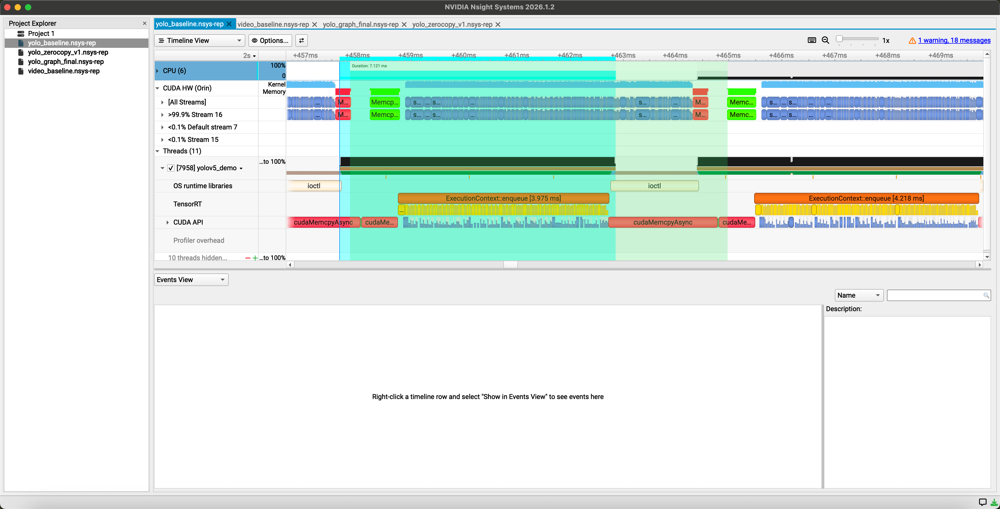
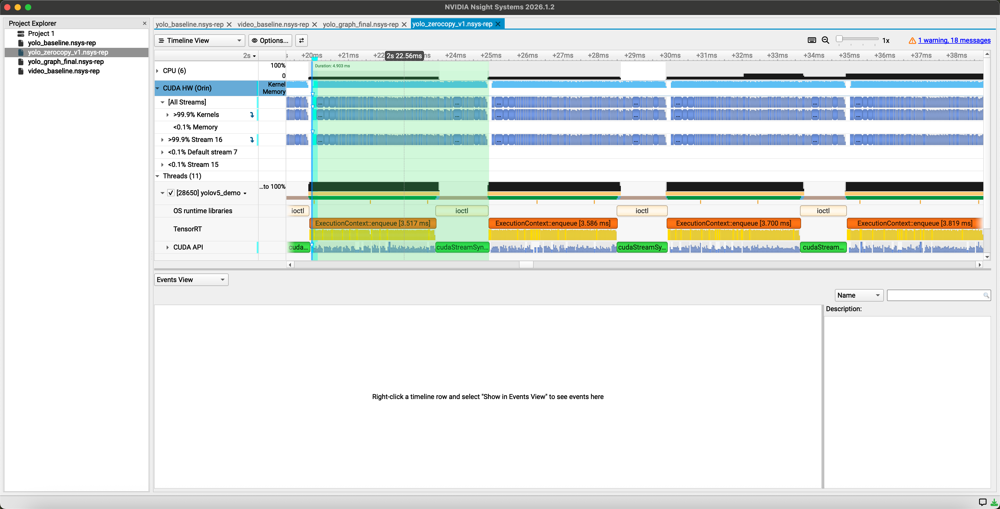
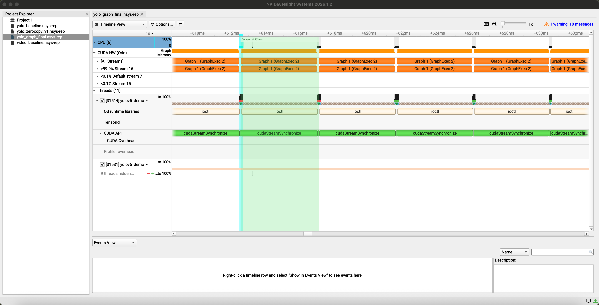

# TensorRT Practice

一个用于学习 **TensorRT / CUDA 推理部署与推理流程优化实践与 profiling** 的实践项目。

项目主要使用 C++ 实现 TensorRT 模型加载、Engine 构建与序列化、推理执行和简单性能测试，并在 Jetson 平台上尝试了一些常见的推理流程优化方法。

## 主要内容

* ONNX 模型解析与 TensorRT Engine 构建、序列化
* TensorRT 推理上下文与输入输出 Tensor 管理
* FP16 推理
* CUDA Stream 异步执行
* pinned / mapped memory 与 zero-copy 实践
* CUDA Graph capture / replay
* 使用 Nsight Systems 对推理流程进行 profiling
* YOLO、ResNet、GoogLeNet、LeNet、MLP 等模型的 TensorRT 推理练习

> 本项目主要用于学习和理解 TensorRT/CUDA 推理框架的基本组成，以及端侧推理过程中内存管理、执行调度和运行时开销等问题，并非完整或通用的高性能推理框架。

## Jetson 上的推理流程优化

以 YOLO 推理为例，在 Jetson 平台上使用 Nsight Systems 分析了不同实现下的执行时间线。

### 1. Baseline

原始实现采用常规 TensorRT 推理流程，可观察到显式数据传输以及推理调用过程中的运行时开销。



### 2. Zero-copy

利用 Jetson CPU/GPU 共享物理内存的特点，尝试使用 pinned / mapped host memory，使 TensorRT 可以直接访问映射后的内存地址，减少显式 Host-Device 数据拷贝。



### 3. CUDA Graph

将 TensorRT `enqueueV3()` 对应的 GPU 执行过程进行 CUDA Graph capture，并在后续推理中通过 Graph replay 执行，以减少重复的 CPU 侧 kernel launch / runtime 调度开销。



以上结果主要用于观察不同实现对推理时间线和运行时行为的影响。当前项目侧重学习与机制验证，暂未将其作为严格的性能 benchmark。

## 项目结构

```text
src/
├── mlp/
├── lenet/
├── googlenet/
├── resnet/
└── yolov5/
```

其中 `src/yolov5/` 包含较完整的 TensorRT 推理、内存管理、CUDA Stream、CUDA Graph 及 profiling 实践。
